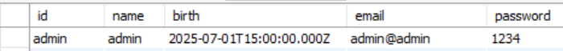
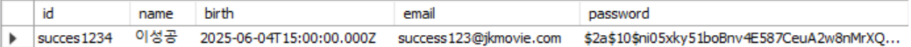

#   SpringBoot BackEnd API

##  프로젝트 소개
Vue 3 및 React 프론트엔드와 연동되는 **Spring Boot 기반 백엔드** 애플리케이션입니다.  
MySQL을 기반으로 회원 관리, 영화 정보 제공, 영화 추천 등의 기능을 제공합니다.  
RESTful API 형식으로 데이터를 주고받으며, 프론트 통합 프로젝트에서 **인증 및 데이터 처리의 중심 역할**을 담당합니다.

---

##  버전  
1.1V
---

##  사용 기술

|     구성 요소     |       적용 내용 (Details)          |
|----------|-----------------------------------------|
| **백엔드 프레임워크**        | Spring Boot          |
| **데이터베이스**       | 	MySQL                   |
| **Object-Relational Mapping**  |JPA                  |
| **빌드 도구**        | Maven                         |

---

##  주요 기능

### 회원 기능

- 회원가입 처리 (POST /api/member/signup) 
사용자 입력 데이터 검증 및 DB 저장 처리

- 인증 처리 (POST /api/member/login) 
세션 기반 로그인 로직 구현

- 세션 상태 확인 (GET /api/member/check-session) 
로그인 여부 유지 및 확인 기능

- 회원 정보 조회 및 수정 (GET/PUT /api/member/{id}) 
인증 사용자 대상 데이터 조회 및 수정 로직

- 회원 탈퇴 처리 (DELETE /api/member/{id}) 
사용자 본인 인증 후 DB에서 회원 정보 삭제 처리

### 영화 도메인 (Movie Domain)
- 영화 목록 조회 API (GET /api/movies) 
전체 영화 리스트 제공

- 영화 상세 정보 제공 (GET /api/movies/{id}) 
특정 영화 ID 기준 상세 정보 제공

- 영화 추천 기능 (GET /api/movies/recommend) 
사용자 성향 기반 추천 알고리즘 연동

### 인증/보안 도메인 (Security Domain)
- 세션 기반 인증 발급 및 검증
로그인 상태 유지를 위한 인증 로직

- 인증 필터 / 인터셉터 구성
비인가 요청 차단 처리

### 공통 처리
- 전역 예외 처리기 (@ControllerAdvice)
예외 상황에 대한 공통 응답 처리

- CORS 설정
Vue3 / React 프론트엔드 요청 허용 설정

---

## API 연동 예시

| HTTP Method | URL | 설명 |
|-------------|-----|------|
| `POST` | `/api/member/login` | 로그인 |
| `POST` | `/api/member/signup` | 회원가입 |
| `GET`  | `/api/movies` | 전체 영화 목록 조회 |
| `GET`  | `/api/movies/{id}` | 영화 상세 정보 조회 |

---
## Database 구조

### 사용 DBMS

- MySQL
- 포트: 3308
- DB 이름: db_member

### 테이블 목록 및 설명
| 테이블명 | 설명 |
|-------------|-----|
| member_table | 회원 정보 테이블 |
| movie_recommendation | 영화 추천 매핑 테이블 |
| movies  | 영화 정보 테이블 |

### 테이블 상세 구조

- member_table

| 필드명               | 타입             | 널 허용 | 키   | 설명               |
| ----------------- | -------------- | ---- | --- | ---------------- |
| `id`              | `VARCHAR(255)` | X    | PRI | 회원 ID (기본키)      |
| `name`            | `VARCHAR(255)` | O    |     | 이름               |
| `birth`           | `VARCHAR(255)` | O    |     | 생년월일 (문자열 형식)    |
| `email`           | `VARCHAR(255)` | X    | UNI | 이메일 (고유)         |
| `password`        | `VARCHAR(255)` | X    |     | 비밀번호             |
 

- movie_recommendations

| 필드명          | 타입            | 널 허용 | 키   | 설명                                 |
| ------------ | ------------- | ---- | --- | ---------------------------------- |
| `id`         | `BIGINT`      | X    | PRI | 추천 ID (기본키, 자동 증가)                 |
| `created_at` | `DATETIME(6)` | O    |     | 추천 생성 일시                           |
| `member_id`  | `VARCHAR(50)` | X    | MUL | 추천한 회원 ID (외래키: `member_table.id`) |
| `movie_id`   | `BIGINT`      | X    | MUL | 추천 영화 ID (외래키: `movies.id`)        |
 

- movies

| 필드명                    | 타입             | 널 허용 | 키   | 설명                 |
| ---------------------- | -------------- | ---- | --- | ------------------ |
| `id`                   | `BIGINT`       | X    | PRI | 영화 ID (기본키, 자동 증가) |
| `created_at`           | `DATETIME(6)`  | O    | MUL | 등록일자               |
| `description`          | `TEXT`         | O    |     | 영화 설명              |
| `genre`                | `VARCHAR(100)` | O    | MUL | 장르                 |
| `poster_url`           | `VARCHAR(500)` | O    |     | 포스터 이미지 URL        |
| `recommendation_count` | `INT`          | O    | MUL | 추천 수 (기본값 0)       |
| `release_date`         | `VARCHAR(20)`  | O    |     | 개봉일자 (문자열)         |
| `title`                | `VARCHAR(255)` | X    | MUL | 영화 제목              |
| `updated_at`           | `DATETIME(6)`  | O    |     | 최종 수정일자            |
 

---

## 프론트엔드 연동

본 백엔드는 다음 프론트엔드 프로젝트와 연동

- Vue3 프로젝트: [C_VUEProject](https://github.com/javakyu0328/C_VUEProject)
- React 프로젝트: [D_REACTProject](https://github.com/javakyu0328/D_REACTProject)

---
## 접속
-  localhost:8083에서 실행됨 (CORS 설정 시 백엔드에서 허용)
- 프로젝트 통합을 통해 클라이언트-서버 간 실제 통신 기반 구조를 구현

---

## 개발자 정보  
이름: 최정규  
이메일: javakyu4030@naver.com

---

## 수정 및 추가 사항
---

###  1. 데이터베이스 회원 비밀번호 암호화 적용
회원 가입 시 사용자의 비밀번호를 평문으로 저장하지 않고, BCrypt 해시 알고리즘을 사용해 암호화하여 DB에 저장합니다.

---
###  버전  
1.1V

---
### 주요 변경 사항
- PasswordEncoder 빈 등록 (설정 클래스 또는 @Bean)
- 회원가입 서비스 (MemberService)에서 비밀번호 암호화 로직 적용

---
### 보안 효과
- 해킹 시 DB 유출이 되어도 비밀번호를 쉽게 알아낼 수 없음
- BCrypt는 솔팅(Salting) + 느린 해싱 방식으로, 무차별 대입 공격(Brute-force)에 강함

---
### 참고 사항
- 로그인 시 입력한 비밀번호는 passwordEncoder.matches(raw, encoded)를 통해 비교함

---
### 실행 화면 예시
1. 적용 전  

2. 적용 후  
